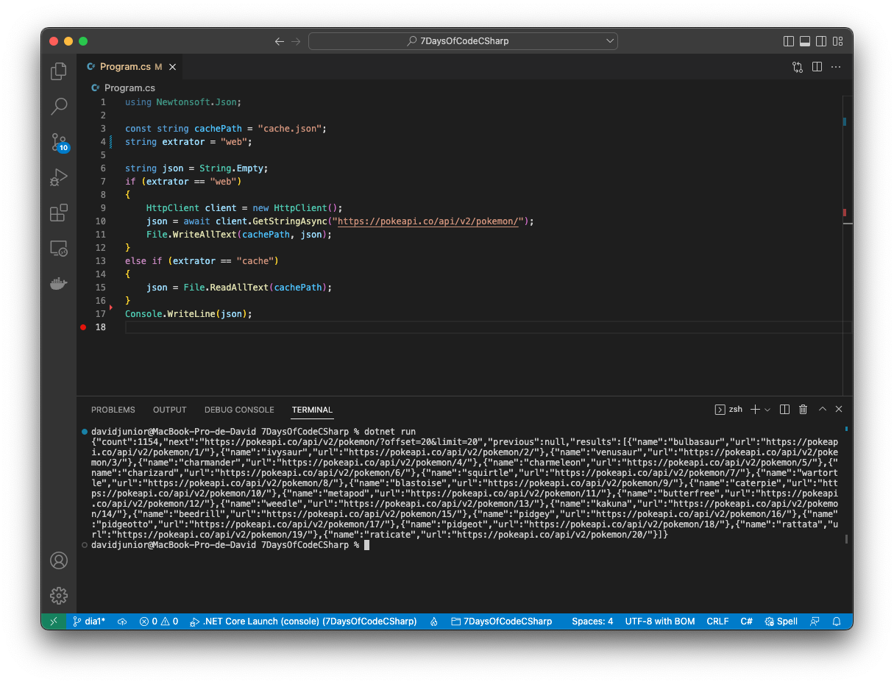

# 7 Days Of Code - C#

## Project Summary:
Consume the PokéAPI (Pokémon API) utilizing just C# language, list the Pokémons and allow the user to choose a Pokémon for "adoption".

## Stack:
- `C# Language`
- `.NET Framework`
- `PokéAPI`
- `Json`

# Day 1:
- [X] Create C# code to execute the HTTP GET request.
- [X] Catch the Json from the request.
- [X] Print the Json on the console.

Using just the library `System.Net` was made a request to the PokéAPI and catched the list of Pockémons Json:

# Day 2:
- [X] Parse the Json response and extract each Pokémon info.
- [X] Show the organized information on the console.

The Json was parsed with the `System.Text.Json.JsonSerializer` class and the class `Pokemon` was created to represent a Pokémon entity.

