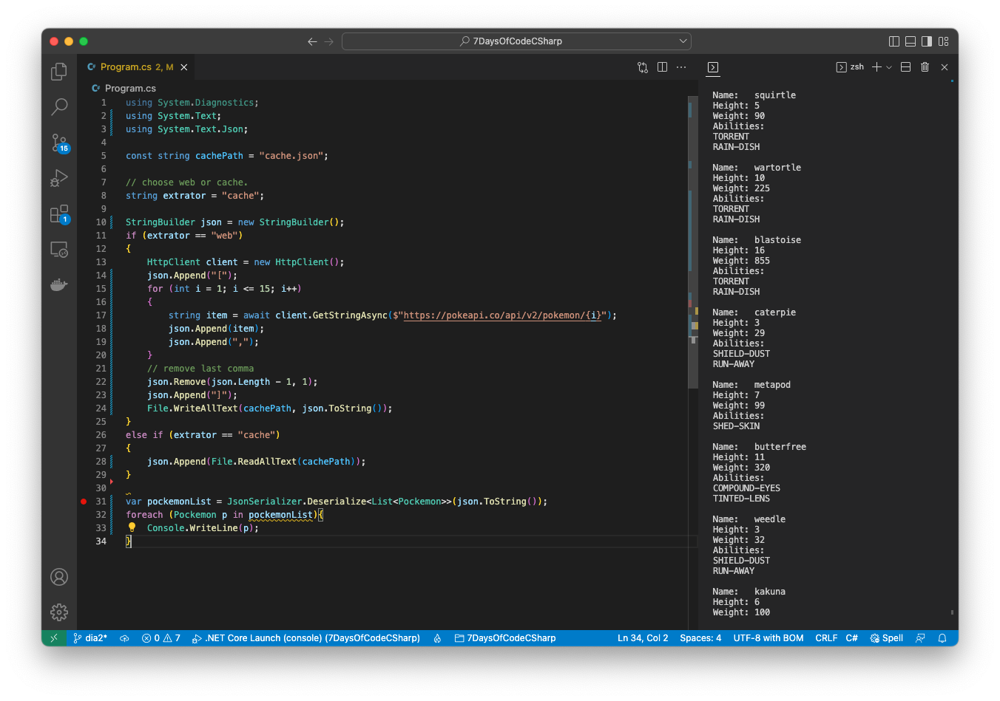
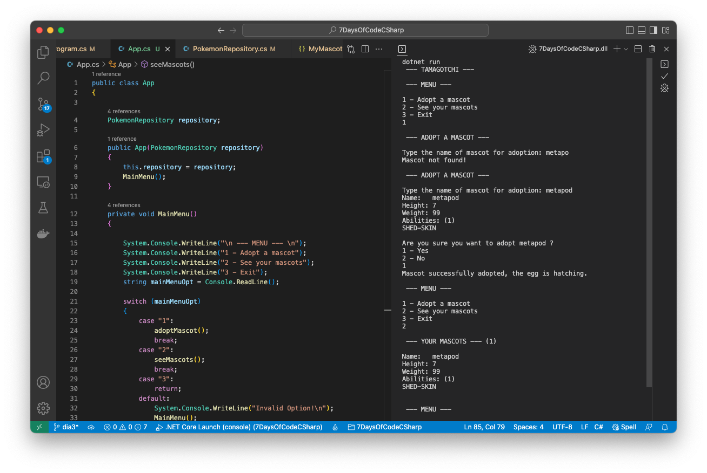
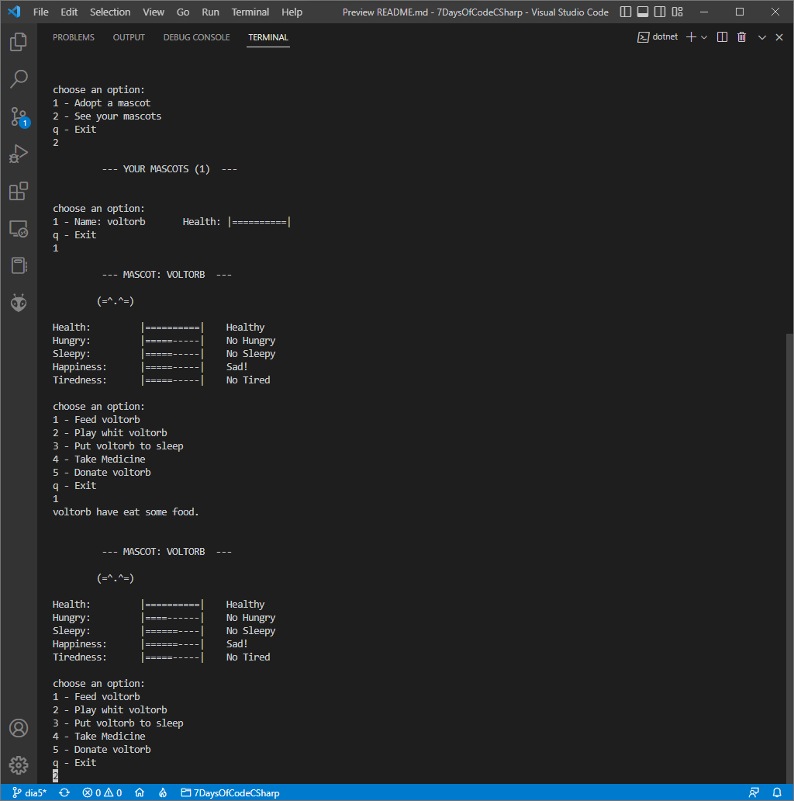

# 7 Days Of Code - C#

## Project Summary:
Consume the PokéAPI (Pokémon API) utilizing just C# language, list the Pokémons and allows the user to choose a Pokémon for "adoption".

## Stack:
- `C# Language`
- `.NET Framework`
- `PokéAPI`
- `Json`

# Day 1:
- [X] Create C# code to execute the HTTP GET request.
- [X] Catch the Json from the request.
- [X] Print the Json on the console.

Using just the library `System.Net` was made a request to the PokéAPI and cached the list of Pokémons Json:

# Day 2:
- [X] Parse the Json response and extract each Pokémon info.
- [X] Show the organized information on the console.

The Json was parsed with the `System.Text.Json.JsonSerializer` class and the class `Pokemon` was created to represent a Pokémon entity.

# Day 3:
- [X] Create an interactive menu and allow user to view your current mascots, choose an mascot to adopt and exit the app.

Was created the class `App` where resides the application interactive menu, and the class `PokemonRepository` responsible for getting from cache/PokeAPI and saving the mascots.

# Day 4:
- [X] Organize the project source files in the MVC (Model View Controller) standard.

The application was divided into classes according to MVC:  
Model: `Ability`, `Mascot`, `Pokemon`  
View: `AppView`  
Controller: `AppController`  

# Day 5:
- [X] Add common mascot attributes hungry, sleepy, happiness, tiredness, health.
- [X] Add mascot actions eat, sleep, play.

# Day 6:
- [X] Create Mascot class.
- [X] Map Pokemon class to Mascot class.

Was created the class `Mascot` that inherit from Pokemon and implements common mascots attributes and actions.

# Day 7:
- [X] Build and generate the executable of the application.

The application was published with the `dotnet publish` command.