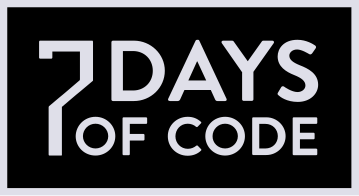

# 7 Days Of Code - C#

## Project Summary:
Consume the PokéAPI (Pokémon API) utilizing just C# language, list the Pokémons and allow the user to choose a Pokémon for "adoption".

## Stack:
- `C# Language`
- `.NET Framework`
- `PokéAPI`
- `Json`

# Day 1:
- [X] Create C# code to execute the HTTP GET request.
- [X] Catch the Json from the request.
- [X] Print the Json on the terminal.

Using just the library `System.Net` was made a request to the PokéAPI e catched the list of Pockémons Json:

